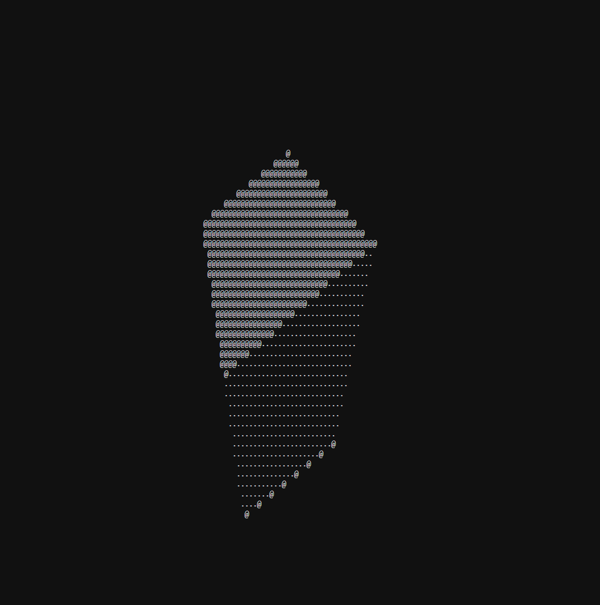

3D ASCII Art Graphics Engine (From Scratch)

🌟 Overview
  This project demonstrates how graphics work at a low level. While modern graphics engines rely on efficient APIs to create 3D visuals, these abstract away much of the magic behind the scenes. With this small graphics engine, built entirely without any graphics APIs and rendered in ASCII art, you can gain a deeper understanding of how computers generate triangles and form 3D shapes.
  
  This project serves as an educational tool for anyone curious about the inner workings of computer graphics.

🚀 Features
  A basic graphics engine rendered in ASCII art.
  No graphics APIs—purely CPU-driven rendering.
  Customizable objects (default object: a cube).
  A great starting point for experimenting with graphics concepts like lighting, optimization, and even ray tracing.
  
🛠️ Installation
  Prerequisites
  
  Ensure you have the following installed:
  
  - A C++ compiler (e.g., clang or g++).
  - A code editor (e.g., Visual Studio Code or your favorite IDE).
  - Git for cloning the repository.
  
  Instructions
  
  - Clone this repository: git clone https://github.com/h3110w0r1d-tech/3D-ASCII-Art-Graphics-Engine-From-Scratch
  - Open the root folder in your preferred code editor (e.g., Visual Studio Code).
  - Compile the code. The compile command can be found at the top of the main source file.

🕹️ Usage
  This project works like a traditional graphics engine:

  The default object is a cube, but you can replace it with any object.
  Feel free to challenge yourself by implementing:
  - A model importer to load custom shapes.
  - Performance optimizations.
  - GPU-based rendering instead of CPU.
  - Advanced features like lighting improvements or ray tracing.
  - Explore, experiment, and learn about the fundamentals of computer graphics through this project!

